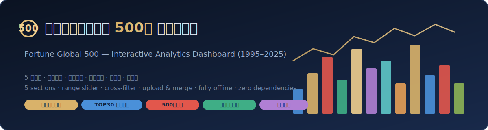

# 《财富》全球企业 500 强分析仪表板 · Fortune Global 500 Dashboard



<p align="center">
  
  
  
  
  
</p>

一个**纯离线、零依赖、单文件**的交互式数据仪表板，复现自 Tableau 工作簿《500 强分析》，基于 1995–2025 年《财富》全球企业 500 强榜单数据。整个应用是**一个 `index.html`**——图表引擎、Excel 解析器、数据全部内联，双击即可打开，无需服务器、无需联网、不加载任何外部脚本。

A single-file, fully-offline, zero-dependency interactive dashboard for the Fortune Global 500 (1995–2025), rebuilt from a Tableau workbook. Everything — the SVG chart engine, the in-browser Excel parser, and the data — is inlined into one `index.html`. Just open it in a browser.

> 🔗 在线预览 / Live demo（启用 GitHub Pages 后）: `https://Sreya0327.github.io/500Fortune/`

---

## ✨ 功能特性 Features

**五大分析板块**

1. **各国上榜趋势** — 中美日 / 韩英法 / 意德其他历年上榜企业数折线图 + 自定义国家多选对比。
2. **TOP30 企业历年变化** — 各国营收/利润规模堆叠面积图、100% 占比趋势、当年 TOP30 企业排名轨迹。
3. **500 强企业简析** — KPI 卡、各国营收矩形树图、营收 TOP20 企业条形图、可排序企业明细表。
4. **中国上榜企业分析** — 数量/平均营收/平均利润/收益率 KPI、数量趋势、经营领域收入饼图、按省份地图、领域条形图。
5. **行业简要分析** — 行业上榜数量/营收趋势、行业 × 年份热力图、当年行业排行。

**交互能力**

- 🎚️ **年份区间条** — 双手柄滑块，联动裁剪所有趋势图的时间跨度，快照年取区间末年。
- 🔗 **联动筛选（cross-filter）** — 点击国家（树图/下拉）或行业（柱子/下拉），KPI、企业榜、明细表、趋势、行业排行同步过滤；国家 + 行业可叠加（AND）。
- 🔎 **TOP30 企业筛选** — 图例即筛选器，单选 / 多选 / 清除。
- 💬 悬停提示、图例高亮、表头排序、树图/柱状下钻。

**数据管理**

- ⤓ **下载底表模板** — 生成表头符合《财富》500 强 Excel 逻辑的 CSV 模板。
- ⤴ **上传数据（自动合并至总表）** — **表头智能匹配**（按列名关键词识别，不依赖列顺序），支持 `.xlsx` / `.csv`；上传年份**覆盖**库中同年数据、其余年份保留（单年增量或整表全量均可）。
- ⤓ **下载所选年份数据** — 按当前区间导出全部上榜企业明细为 CSV（含总部）。

---

## 🚀 快速开始 Quick Start

**方式一：直接打开**

下载本仓库后，双击 `index.html` 即可（任意现代浏览器，无需联网 / 服务器）。

**方式二：GitHub Pages（推荐分享）**

1. Push 到你的仓库（见下方命令）。
2. 仓库 **Settings → Pages → Build and deployment → Source: `Deploy from a branch`**，Branch 选 `main` / 目录选 `/ (root)`，保存。
3. 稍等一分钟，访问 `https://Sreya0327.github.io/500Fortune/`。

> 本仓库已内置 `.github/workflows/pages.yml`，push 到 `main` 后会自动部署 Pages（在 Settings → Pages → Source 选择 `GitHub Actions` 即可启用）。

---

## 📤 发布到 GitHub Publish to GitHub

在项目文件夹内执行（把 `<repo>` 换成你想要的仓库名，默认 `fortune-global-500-dashboard`）：

```bash
git init
git add .
git commit -m "feat: Fortune Global 500 interactive dashboard"
git branch -M main
git remote add origin https://github.com/Sreya0327/500Fortune.git
git push -u origin main
```

> 需先在 GitHub 上创建同名空仓库（不要勾选 README/License，以免冲突）。

---

## 🗂️ 数据格式与更新 Data Format & Update

仪表板的"总表数据库"每行是**某公司在某一年的榜单记录**。上传解析采用**表头关键词智能匹配**，因此列顺序任意、支持三种来源：原《总表》格式、官方《500 强榜单》格式、以及本仓库的 `data/500强底表模板.csv`。

识别的字段（按列名关键词）：

| 字段 | 匹配关键词（列名包含即可） | 说明 |
|---|---|---|
| 年份 | `年份` 或 `年度` | 必填，非数字行自动跳过 |
| 排名 | `排名` | 必填 |
| 公司名(中文) | `中文名` 或（`公司名` + `中文`） | |
| 公司名(英文) | `公司名称`（不含中文）或（`公司名` + `英文`） | |
| 国家 | `国家`（不含 `英文`） | 取中文国名 |
| 行业 | `行业`（优先 `聚合`，否则普通 `行业`） | |
| 营收 | `营收` / `营业收入`（排除 `增减`/`率`） | 百万美元 |
| 利润 | `利润`（排除 `率`/`增减`） | 百万美元 |
| 总部 | `总部` | 用于中国省份地图 |

**更新流程**：`下载底表模板` → 按年填入数据 → `上传数据(合并至总表)`。上传后按年**覆盖合并**并即时重算全部图表。例如上传《2025 年世界 500 强》即可补齐 2025 年的行业与总部字段。

---

## 🧩 技术实现 Tech

- **无框架、无 CDN、无构建**：一个 `index.html` 内联全部逻辑。
- **图表引擎**：自研轻量 **SVG** 绘制（折线 / 面积 / 堆叠 / 100% 堆叠 / 条形 / 饼图 / 矩形树图 / 热力图），含 tooltip、图例、区间裁剪、联动。
- **Excel 解析**：内联 [`fflate`](https://github.com/101arrowz/fflate)（解压 `.xlsx`）+ 自研 SharedStrings/Sheet XML 解析 + CSV 解析 + 表头智能匹配。
- **数据聚合**：浏览器端 JavaScript 聚合，与离线预生成数据**逐字节一致**（默认数据与"重新上传同一底表"结果完全相同）。

---

## 📁 目录结构 Structure

```
fortune-global-500-dashboard/
├── index.html                 # 仪表板（单文件应用，含数据/引擎/解析器）
├── README.md
├── LICENSE
├── .gitignore
├── .github/workflows/pages.yml # GitHub Pages 自动部署
├── data/
│   └── 500强底表模板.csv        # 底表模板（表头按 500 强 Excel 逻辑）
└── docs/
    └── banner.svg
```

---

## 📊 数据来源 Data Source

《财富》(Fortune) 全球企业 500 强历年榜单（1995–2025）。本项目仅用于数据可视化与学习交流。

## 📜 许可证 License

[MIT](LICENSE) © 2025 [Sreya0327](https://github.com/Sreya0327)
